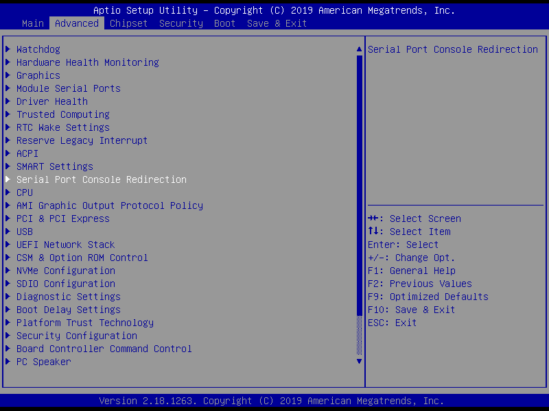

# Console redirection

!!! note
    By default, in bios console redirection is disabled, for initial configuration you need a DP monitor.

## Conga-MA5

**1. Enable console redirection in BIOS.**

`ESC` or `DEL` &#8594; `Advanced` &#8594; `Serial Port Console Redirection` &#8594; `COM2` or `COM3` &#8594; `Enable`

COM2 is equal to COM0 on SYS board, COM3 is equal to COM1 on SYS board (BIOS ver. MA50R153). Console parameters can be left default.

{: width=85% .center }

{: width=85% .center }

**2. Connect UART-USB cable to COM0/COM1 (GND/TX/RX pins).**

**3. Open TeraTerm or other terminal program and set 115200 8N1.**

**4. Apply power to Platform.**

**5. Now you can see BIOS in terminal window.**

**6. Сonfigure LUbuntu for system console.**

Check that the COM port is working (ttyS6 - COM0, ttyS7 - COM1):

```bash
sudo chmod o+rw /dev/ttyS6
echo '123' > /dev/ttyS6
```

Create conf file for GRUB:

```bash
sudo mkdir /etc/default/grub.d
sudoedit /etc/default/grub.d/serial.cfg
```

Add the required `ttyS*`:

```bash
GRUB_CMDLINE_LINUX="console=tty1 console=ttyS6,115200n8"
GRUB_TERMINAL_INPUT="console serial"
GRUB_TERMINAL_OUTPUT="gfxterm serial"
GRUB_SERIAL_COMMAND="serial --unit=0 --speed=115200 --stop=1"
```

Update GRUB configuration:

```bash
sudo update-grub
```

Enable the console on the desired `ttyS*` at system startup and reboot:

```bash
sudo systemctl enable getty@ttyS6
reboot
```

**7. Console will be available via USB-UART after system boot.**

## Disabling the console

Turn off console service:

```bash
sudo systemctl enable getty@ttyS4
```

Delete config:

```bash
sudoedit /etc/default/grub.d/serial.cfg
```

Update GRUB config and reboot:

```bash
sudo update-grub
sudo reboot
```
