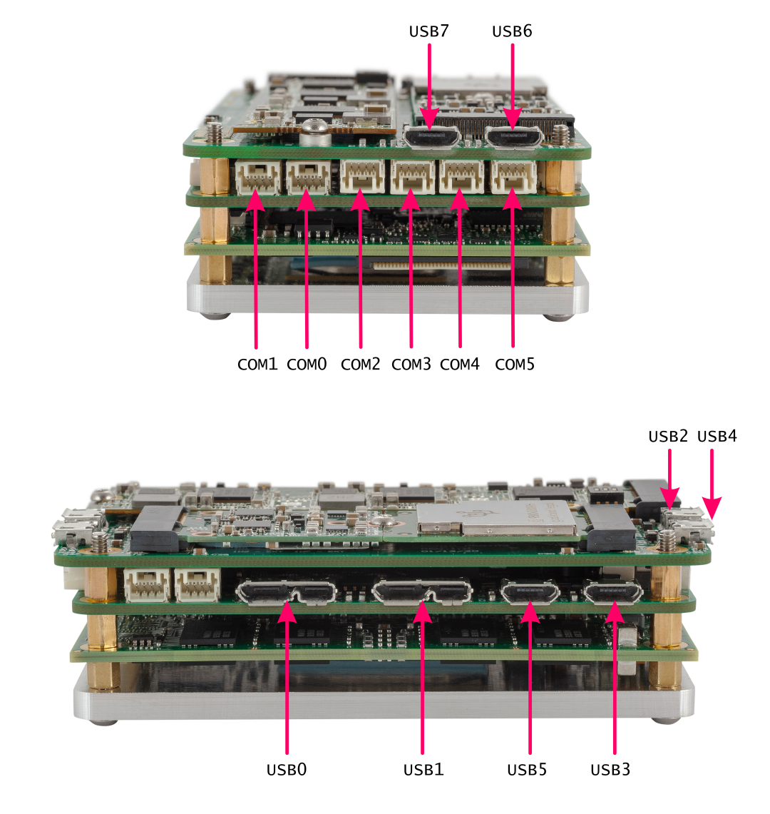

# Interface tests

## Interfaces overview

Interface tests are able to verify that all I/O ports working correctly.
Tests are grouped by interface type: [UART](#test-uart), [USB](#test-usb), [PCIe](#test-pcie).

Platform has 6 COM(UART) ports, 8 USB ports, 4 PCIe ports (1 port per each M type M.2 connector and 2 ports routed to E type M.2 connector).



## Test UART

Special UART loopback cable are included with FastSense X Platrorm for this test.

Install missing dependencies if any. Install pyserial:

```shell
sudo apt-get install --no-install-recommends python3-pip
pip3 install pyserial
```

Download [`loopback_test.py`](https://github.com/FastSense/fastsensex_hw_tests/blob/master/loopback_test.py) script:

```
wget https://raw.githubusercontent.com/FastSense/fastsensex_hw_tests/master/loopback_test.py
```

Follow these steps to complete:

  1. run the script: `python3 loopback_test.py`;
  2. select ma5;
  3. select test type - simple;
  4. connect loopback cable to selected port;
  5. select port for testing;
  6. wait for the result - pass/fail;
  7. repeat 4-6 for all available COM(UART) ports.

## Test USB

Use 3.0 USB Flash drive for this test, otherwise results will be lower.

Install missing dependencies if any. Download [`usb_check.sh`](https://github.com/FastSense/fastsensex_hw_tests/blob/master/usb_check.sh) script:

```
wget https://raw.githubusercontent.com/FastSense/fastsensex_hw_tests/master/usb_check.sh
```

Add appropriate rights to this file:

```
chmod +x ./usb_check.sh
```

Disconnect any USB storage devices.

Follow these steps to complete:

  1. connect 3.0 USB Flash drive to selected port via adapter (micro USB B 3.0 to USB A 3.0 jack adapter or micro USB B 2.0 to USB A 2.0 jack cable);
  2. run script: `sudo ./usb_check.sh`;
  3. wait for the result &mdash; XXX MB/s (3.0 ports should have > 200MB/s and 2.0 ports should have >35MB/s)

Repeat steps 1-3 for all available USB ports.

## Test PCIe

This test allows you to check that all 4 PCIe devices are visible on PCIe bus.

Install missing dependencies if any. Download [`pcie_test.sh`](https://github.com/FastSense/fastsensex_hw_tests/blob/master/pcie_test.sh) script:

```
wget https://raw.githubusercontent.com/FastSense/fastsensex_hw_tests/master/pcie_test.sh
```

Add appropriate rights to this file:

```
chmod +x ./pcie_test.sh
```

Follow these steps to complete:

  1. run the script: `sudo ./pcie_test.sh`;
  2. check script output for the available devices.
