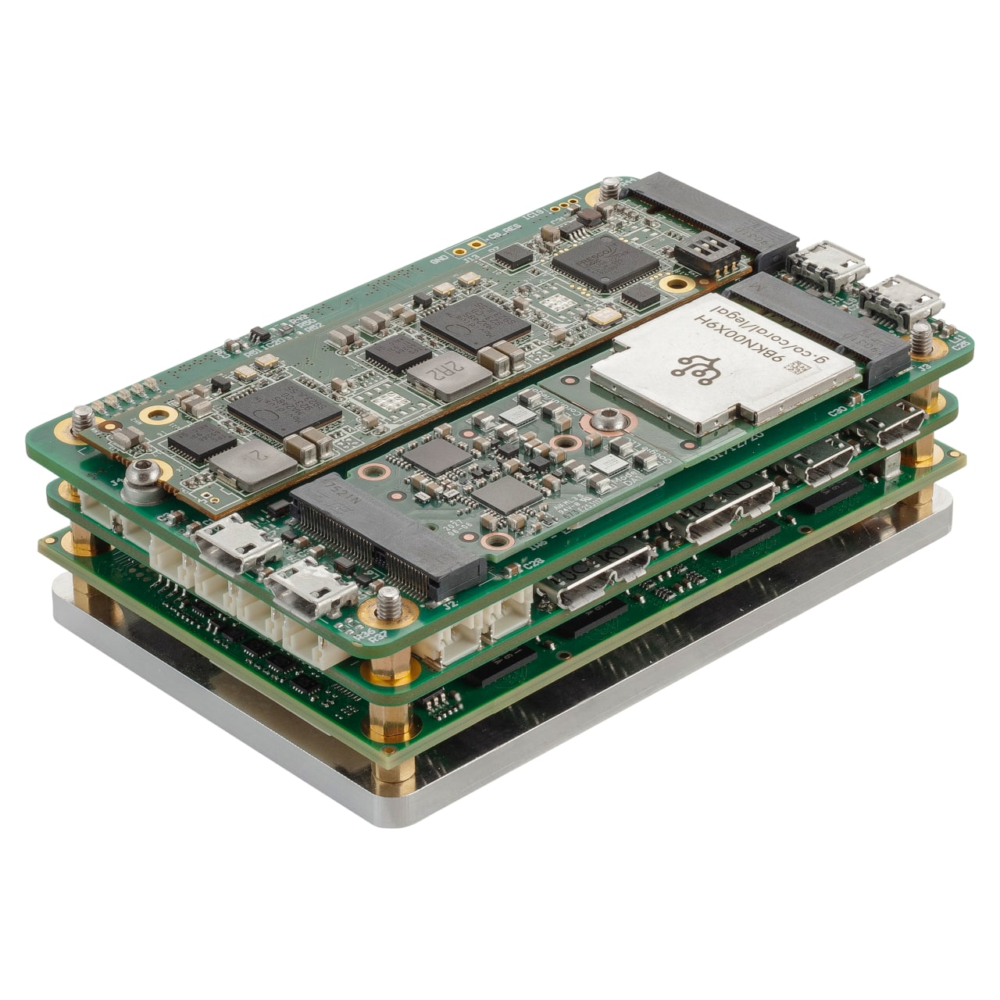
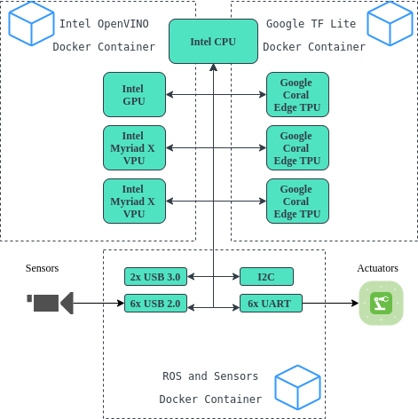

# Fast Sense X 

## What is it?

[Fast Sense X Robotics AI Platform](https://www.fastsense.tech/robotics_ai) is a powerful on-board computer bringing scalable Edge AI capabilities to mobile robotics. 

It consists of single board COM Express module with Intel CPU, set of edge AI accelerators to inference several neural nets on-board in real time and has numerous hardware interfaces to robotic sensors and actuators. AI accelerators are connected using M.2 PCIe interface and can be scaled depending on the task. 

It is shipped as ready to use device with software examples of running ROS algorithms with integrated neural nets meaningful for robotic applications running in isolated Docker containers. 

{: .center width=62% }

Possible configuration below consists of Intel CPU coupled with six edge AI inference devices including Intel Myriad X VPUs and Google Coral Edge TPUs.

{: .center }

## Specification

|                     |                                                                                                                                                                                                                                                                                                                                                                        |
|---------------------|------------------------------------------------------------------------------------------------------------------------------------------------------------------------------------------------------------------------------------------------------------------------------------------------------------------------------------------------------------------------|
| **Edge AI devices** | Intel UHD Graphics (Gen11)*    2x Intel Myriad X ([AI CORE XM 2280 m.2 module](https://www.aaeon.com/en/p/ai-edge-computing-board-ai-core-xm-2280))   3x Google Edge TPU ([Coral M.2 Accelerator](https://coral.ai/products/m2-accelerator-bm/) +   [Coral M.2 Accelerator with Dual Edge TPU](https://coral.ai/products/m2-accelerator-dual-edgetpu/)) |
| Edge AI perf        | 20 TOPS                                                                                                                                                                                                                                                                                                                                                                |
| CPU*                | Intel® Atom™ x6425E 3.00 GHz (Burst)      1.8 GHz Clock Quad Core L2 cache 2MB                                                                                                                                                                                                                                                                                    |
| DRAM*               | max. 16GB LPDDR4x                                                                                                                                                                                                                                                                                                                                                      |
| I/O Interfaces*     | 2x USB 3.1, 6x USB 2.0, 6x UART, I2C, 1wire, Display port                                                                                                                                                                                                                                                                                                              |
| Onboard storage*    | UFS 2.0 onboard flash up to 64 GB                                                                                                                                                                                                                                                                                                                                      |
| Operating System    | Lubuntu 18.04.5 LTS                                                                                                                                                                                                                                                                                                                                                    |
| Power Consumption   | less then 24W TDP (CPU/GPU - 12W, Edge AI - 11W)                                                                                                                                                                                                                                                                                                                       |
| Size                | 30 x 55 x 84 mm (1.18” x 2.17” x 3.31”) incl. heat-spreaders

_*TBD table star._

## Kit contents

Fast Sense X Robotics AI Platform ships as ready to use device.
Content included in the kit are follows:

  1. Fast Sense X Robotics AI Platform &mdash; 1 pc;
  2. micro USB B 3.0 to USB C 3.0 flat cable (20cm) &mdash; 2 pcs;
  3. micro USB B 3.0 to USB A 3.0 jack adapter &mdash; 1 pc;
  4. micro USB B 2.0 to USB A 2.0 jack cable &mdash; 2 pcs;
  5. miniDP to DP adapter &mdash; 1 pc;
  6. UART loopback cable &mdash; 1 pc;
  7. usb-wifi stick &mdash; 1 pc;
  8. power adapter cable (2.1mm/5.5mm jack diameter) &mdash; 1 pc.