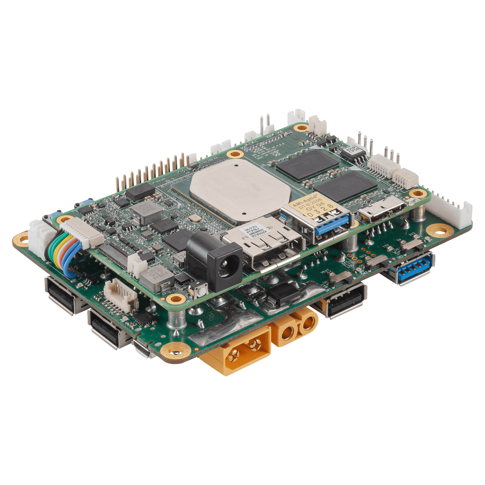

# Welcome to FastSenseX documentation

Fast Sense Robotics AI Platform is powerful on-board computer bringing scalable Edge AI capabilities to mobile robotics. 

It consists of single board COM Express module with Intel CPU, set of edge AI accelerators to inference several neural nets on-board in real time and has numerous hardware interfaces to robotic sensors and actuators. 

It is shipped as ready to use device with software examples of running ROS algorithms with integrated neural nets meaningful for robotic applications. 



## Mkdocs and Markdown hints

[Ссылка](https://github.com/adam-p/markdown-here/wiki/Markdown-Cheatsheet)  на небольшой гайд по Markdown.

Для работы над документацией:
```
pip3 install mkdocs
git clone git@github.com:FastSense/fastsense-x-documentation.git
cd fastsense-x-documentation
mkdocs serve
```
Теперь в браузере можно открыть [http://localhost:8080/](http://localhost:8080/) И увидеть локально развернутую документацию

## Project layout

    mkdocs.yml    # The configuration file.
    docs/
        assets/   # Storage for all the media (e. g. images or PDFs for datasheet)
            img/  # All the image data
        index.md  # The documentation homepage.
        ...       # Other markdown pages, images and other files.
