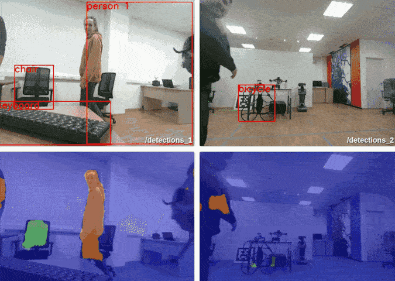

# [Table demo](https://github.com/FastSense/edge_ai_demo)

This demo shows the simultaneous processing of five neural networks running on hardware accelerators for processing
input video streams from two cameras.

Demo was launched on [**Fast Sense X**](https://fastsense.readthedocs.io/en/latest/) ([website](https://www.fastsense.tech/robotics_ai))
which is a powerfull x86 on-board computer with easy to plug in
edge ai accelerators.
For this demo, five such devices are used:

* two **Myriad X** devices;
* three **Coral** devices.

Neural networks model creation on these devices are greatly simplified by [**nnio**](https://github.com/FastSense/nnio) python package which we are providing.  

We are also using **ROS** framework as a middleware for image transport and other message exchange,
so you can easily get access to the models inference results from within ROS ecosystem.

For each video stream, image segmentation is performed using a
[DeepLabV3](https://github.com/tensorflow/models/tree/master/research/deeplab),
as well as object detection using a 
[SSD_Mobilenet_v2](https://aihub.cloud.google.com/p/products%2F79cd5d9c-e8f3-4883-bf59-31566fa99e49),
and for each detected person, its identifier is determined using
[ReID OsNet](https://github.com/KaiyangZhou/deep-person-reid).

*Detection node*  runs SSD MobileNet inference for object detection and double OsNet for person reidentification.

*Segmentation node* runs DeepLabV3 for segmentation. This node runs in duplicate.

More info in the [**repository**](https://github.com/FastSense/edge_ai_demo)